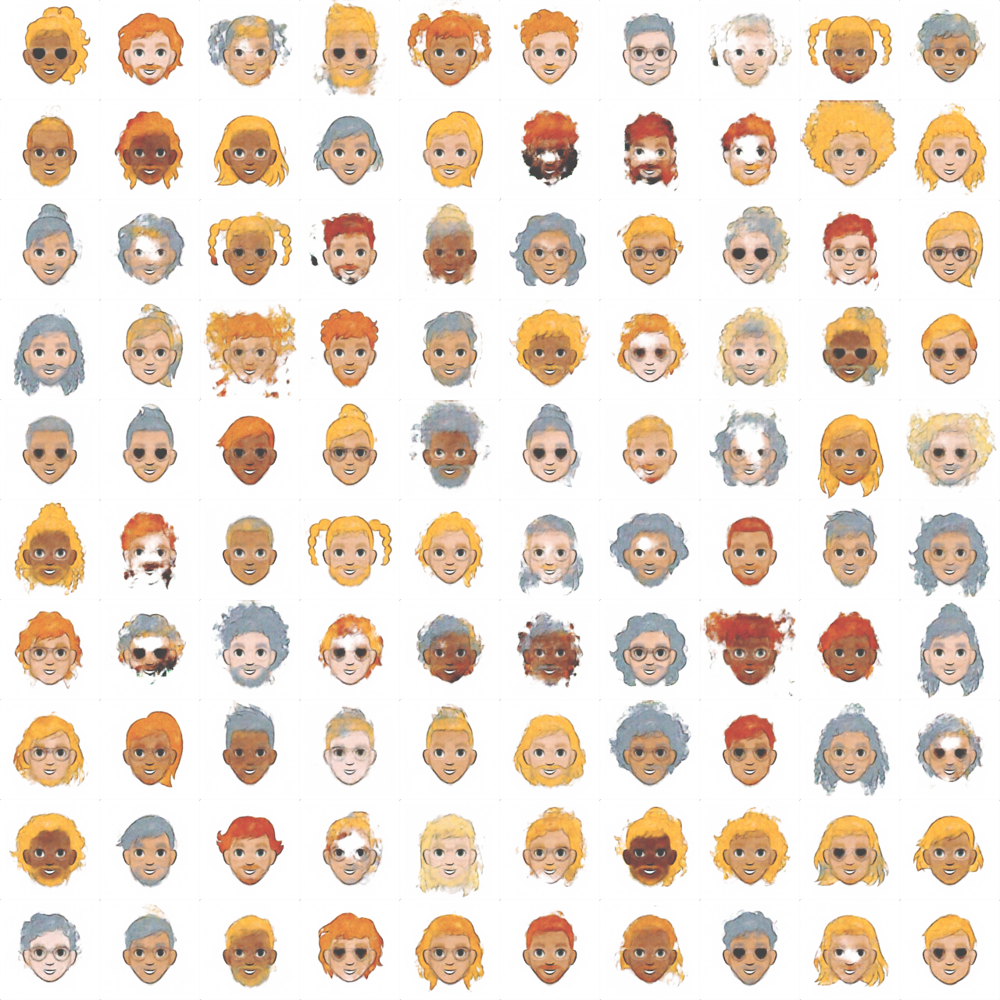
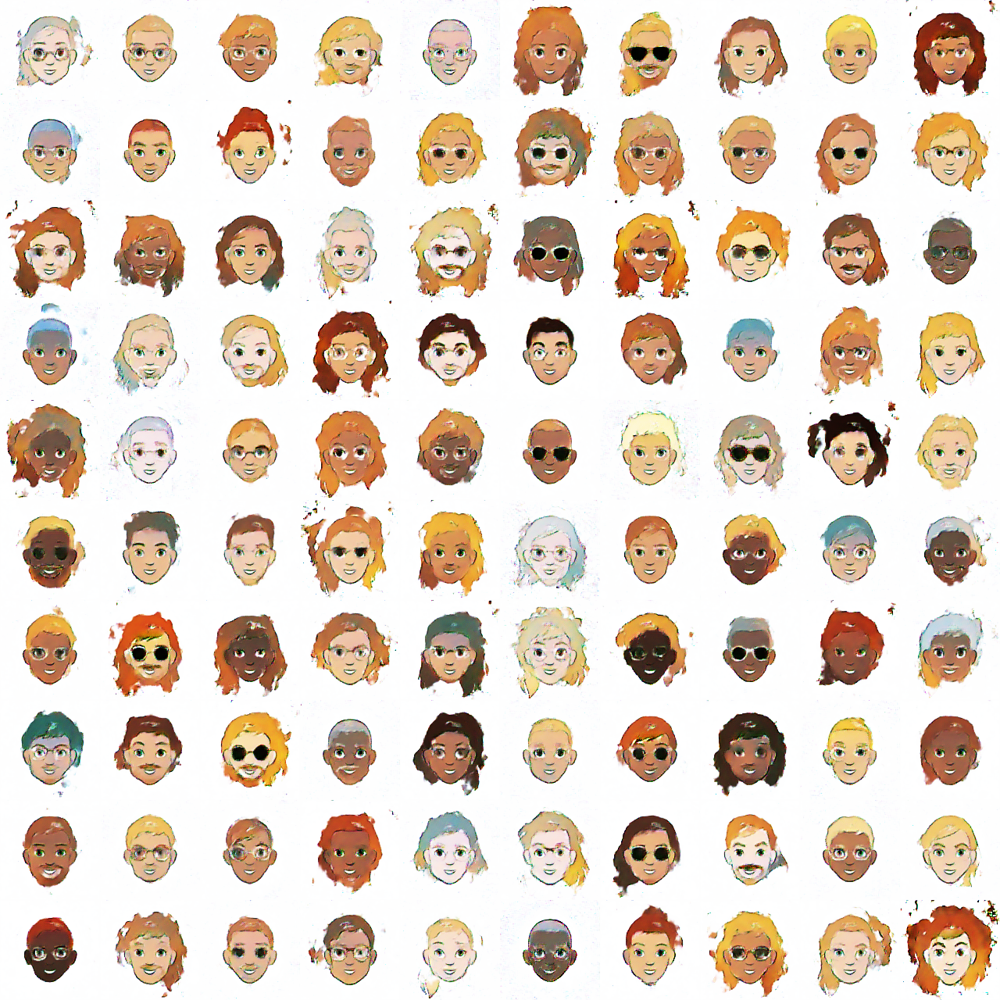

- [**Google Cartoonset**](https://google.github.io/cartoonset/)
   - wget https://storage.cloud.google.com/cartoonset_public_files/cartoonset100k.tgz

- Set-up
   ```
   pip install -r requirements.txt
   ```
- Train
   ```
   python main_vae.py --batch_size 256 --lr 1e-4
   python main_gan.py --batch_size 256 --lr 1e-4
   ```

- VAE
   

- GAN
    